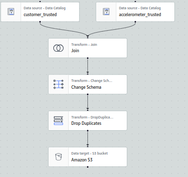

# Project: STEDI Human Balance Analytics

In this project, we are data enginiers for the STEDI team. We will build a data lakehouse solution for sensor data that trains a ML model. We have three different data sources.
- Customers: data about the customers. Only if the customer agreed to shre their data for research purposes we can include them in the machine learning model.
- Accelerometer: data about the possition of the user in a timestamp.
- step_trainer: data coming from the device.

In summary, we will extract the data produced by the step_trainer and the accelerometer and curate it into a data lakehouse solution on AWS so the Data Scientists can train the learning model. We will be using Athena, Glue and S3.

The data lakehouse will have the following structure in S3: 

```
customer/
- landing/
- trusted/
- curated/
accelerometer/
- landing/
- trusted/
step_trainer/
- landing/
- trusted/
- curated/
machine_learning/
```


## Step 1: Upload the data to S3  

The files are saved inside the data folder organized by the source. First, we must upload these files to S3 with the next script.

```bash
aws s3 cp ./data/ \s3://jh-data-lakehouse/ --recursive
```

Note that all the files we just uploaded belong to the landing zone in our datalakehouse structure.

## Step 2: Build the data catalog 

We have to create a database in Glue called jhoffmann-datalake. Inside this database we will define three glue tables.
- customer_landing
- accelerometer_landing
- step_trainer_landing

The DDL scripts generated by Athena can be found inside the /scripts folder. 

Next, we can see the number of rows of each glue table.

**Customer_landing table:** 


**Rows of Accelerometer table:**


**Step_trainer table:**


We check and we have customers that didnt agreed to share their data for research. These customers must be excluded from the nexts steps.


## Step 3: Customer landing to trusted
We build a Glue Job to exclude the customers that do not have data in the sharedWithResearchAsOfDate column. The scripts is saved inside the scripts folder. Next, the Visual of the Glue Job:


In this case, we let Glue Job dynamically infer and update the schema of the new table. To do this, we enabled the option *Create a table in the Data Catalog and, on subsequent runs, update the schema and add new partitions option to True*. The new table is called customer_trusted.

Next, we check the number of rows of customer_trusted. We can check that the number corresponds to the initial amount minus the number of customer who didnt want to share their data. This is 956 - 974 = 482.


## Step 4: Accelerometer landing to trusted
Next, we will proccess the accelerometer landing data. To do this, we will inner join the accelerometer landing with the customer trusted. Then, we will only keep register of customers that share their data. Again, Glue will infer and update the schema of the new table: accelerometer_trusted. The script can be found in the scripts folder.


Next, we check the number of rows and the columns of accelerometer trusted. Note tht we only kept the columns of accelerometer landing.


## Step 5: Customer Trusted to curated
We now have to curate the customer data. To do this, we join the trusted customer data with accelerometer trusted data. We will generate the new glue table called customer_curated. The script can be found in the script folder.



We can check the number of rows of curated customer data.


## Step 6: Step trainer landing to trusted
To process the step trainer landing data we have to join it with the customer curated data. Then, we just keep the info of the step trainer. Again, this assure that we just keep data of customers who agreed to share. Glue will create the table step_trainer_trusted. The script can be found in the script folder.


Next, we can check the number of rows:


## Step 7: Trusted data to machine learning curated
Lastly, we can generate the machine learning curated data. To do this, we build a Glue Job called machine learning curated. The script can be found in the scripts folder. The script will create a glue table called machine_learning_curated.

Next, we see the visual of the job.


The most important thing of this job is the next sql script. It will join our three trusted data sourced in one final table. 
```sql
Select 
    s.sensorreadingtime,
    s.serialnumber,
    s.distancefromobject,
    a.timestamp,
    a.x,
    a.y,
    a.z
from 
    step_trainer s
    inner join accelerometer a on a.timestamp = s.sensorreadingtime
    inner join customer c on c.email  = a.user
--where c.sharewithresearchasofdate < s.sensorreadingtime
```

Note two things
- We didint keep info user of each observation. In this way, we protect the privacy of the users.
- There is commented where clause. If we use it, we will have less data, but we assure that every observation used had the permission to use it. In simple words, just keep dat that took place after the user granted permission.

Finally, we check the number of observations in our machine learning curated table.
